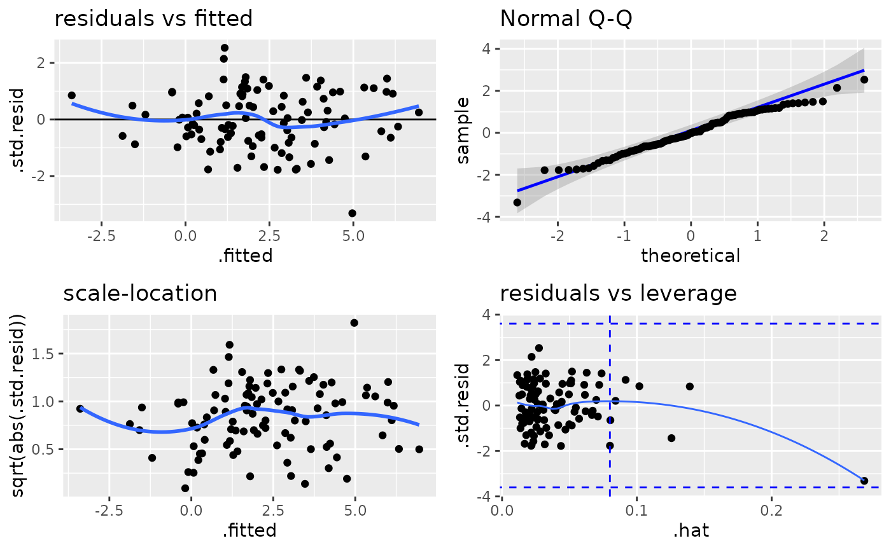
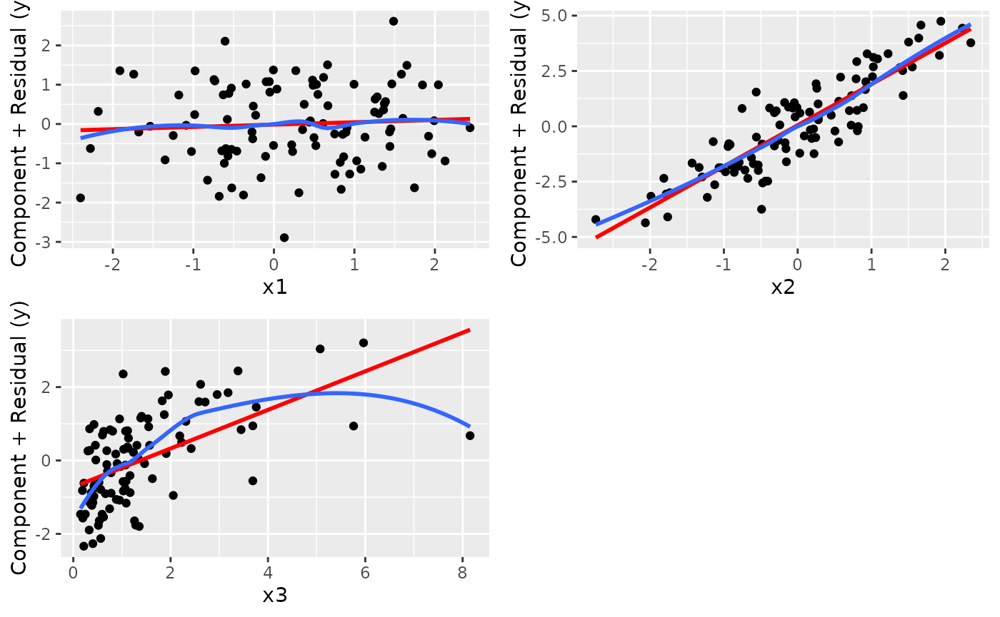
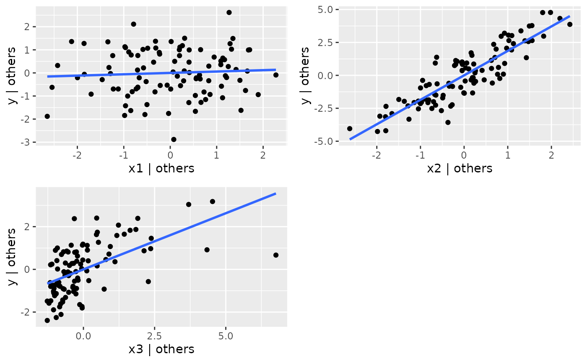
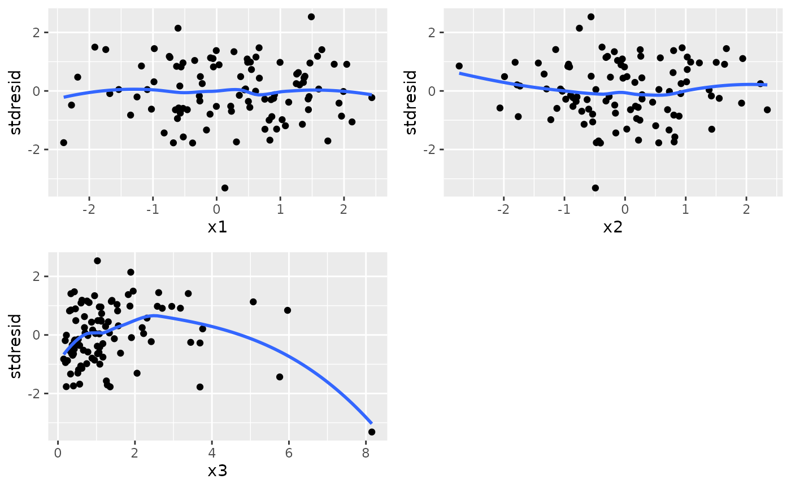
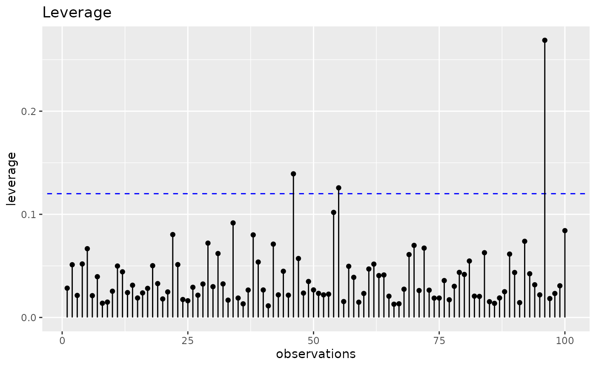
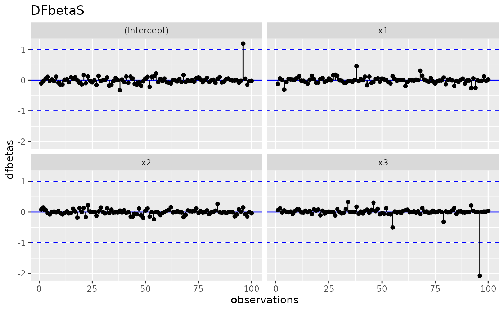
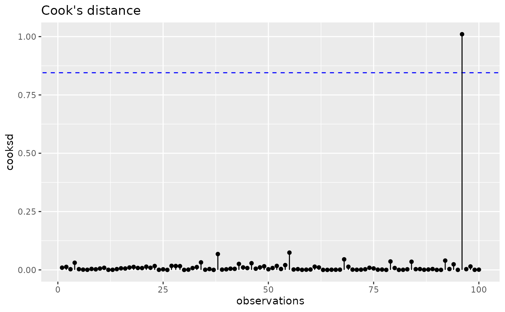
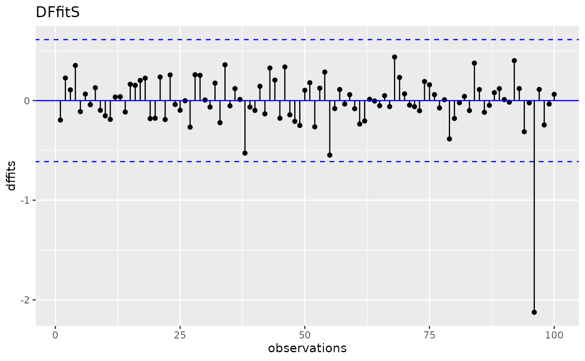
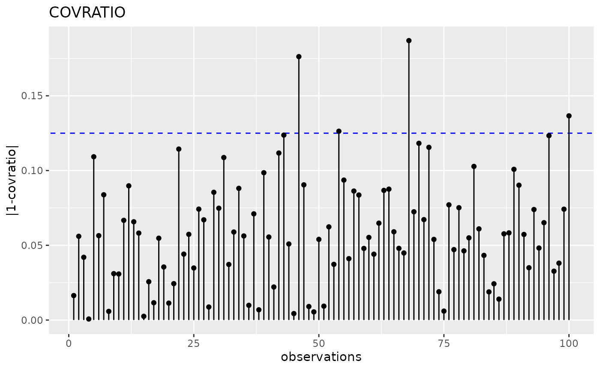

# Análise de resíduos

``` r

library(tidyverse)
library(reglin)

set.seed(1234567890)

n <- 100
simdata <- data.frame(
  x1 = rnorm(n),
  x2 = rnorm(n),
  x3 = exp(rnorm(n))
) |>
  mutate(
    y = simdata <- rlm(~ x1 + x2 + log(x3), beta = c(2.3, 0, 1.7, 1), sigma = 1)
  )

glimpse(simdata)
#> Rows: 100
#> Columns: 4
#> $ x1 <dbl> 1.34592454, 0.99527131, 0.54622688, -1.91272392, 1.92128431, 1.3719…
#> $ x2 <dbl> -0.67596036, 1.50263254, 1.02472510, -0.38030432, 1.92037360, 0.276…
#> $ x3 <dbl> 0.6216812, 2.9560186, 1.1340223, 1.9540347, 1.0850314, 1.3069312, 0…
#> $ y  <dbl> -0.40846685, 6.95514925, 4.85219640, 3.27567494, 5.42484220, 3.3157…

# escala incorreda de x3:
fit <- lm(y ~ x1 + x2 + x3, data = simdata)

ggresiduals(fit, type = "default")
```



``` r
ggresiduals(fit, type = "crPlots")
```



``` r
ggresiduals(fit, type = "avPlots")
```



``` r
ggresiduals(fit, type = "covPlots")
```



``` r


# testes:
testResiduals(fit)
#> 
#> Shapiro-Wilk normality test 
#>      W p.value
#>  0.987  0.4373
#> ------ 
#> 
#> Non-constant Variance Score Test 
#> Variance formula: ~ fitted.values 
#> Chisquare = 1.397527, Df = 1, p = 0.23714
#> ------ 
#> 
#> Durbin-Watson Test for Autocorrelated Errors 
#>  lag Autocorrelation D-W Statistic p-value
#>    1     -0.08969188      2.165836   0.412
#>  Alternative hypothesis: rho != 0
#> ------ 
#> 
#> Bonferroni Outlier Test 
#> No Studentized residuals with Bonferroni p < 0.05
#> Largest |rstudent|:
#>    rstudent unadjusted p-value Bonferroni p
#> 96 -3.50531         0.00069782     0.069782

# análise (gráfica) de influência:
gginfluence(fit, measure = "leverage")
```



``` r
gginfluence(fit, measure = "dfbetas")
```



``` r
gginfluence(fit, measure = "cooksd")
```



``` r
gginfluence(fit, measure = "dffits")
```



``` r
gginfluence(fit, measure = "covratio")
```


