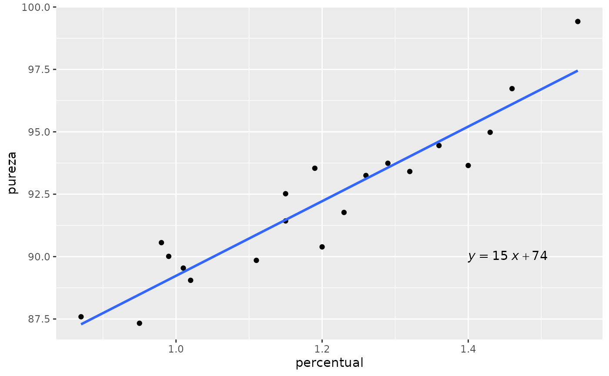

# Introdução ao pacote reglin

``` r
library(reglin)
library(tidyverse)
library(ggpubr)

data(pureza)
glimpse(pureza)
#> Rows: 20
#> Columns: 2
#> $ percentual <dbl> 0.99, 1.02, 1.15, 1.29, 1.46, 1.36, 0.87, 1.23, 1.55, 1.40,…
#> $ pureza     <dbl> 90.01, 89.05, 91.43, 93.74, 96.73, 94.45, 87.59, 91.77, 99.…

ggplot(pureza, aes(x=percentual, y=pureza)) +
  geom_point() +
  geom_smooth(method = "lm", se = FALSE) +
  stat_regline_equation(label.x = 1.4, label.y = 90, aes(label = after_stat(eq.label))) 
```



``` r

fit <- lm(pureza ~ percentual, data = pureza)
summary(fit)
#> 
#> Call:
#> lm(formula = pureza ~ percentual, data = pureza)
#> 
#> Residuals:
#>      Min       1Q   Median       3Q      Max 
#> -1.83029 -0.73334  0.04497  0.69969  1.96809 
#> 
#> Coefficients:
#>             Estimate Std. Error t value Pr(>|t|)    
#> (Intercept)   74.283      1.593   46.62  < 2e-16 ***
#> percentual    14.947      1.317   11.35 1.23e-09 ***
#> ---
#> Signif. codes:  0 '***' 0.001 '**' 0.01 '*' 0.05 '.' 0.1 ' ' 1
#> 
#> Residual standard error: 1.087 on 18 degrees of freedom
#> Multiple R-squared:  0.8774, Adjusted R-squared:  0.8706 
#> F-statistic: 128.9 on 1 and 18 DF,  p-value: 1.227e-09
```
