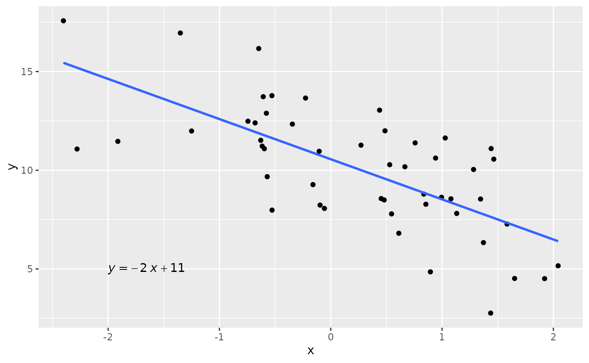

# Simulação de dados com estrutura de regressão linear

Vamos utilizar a função
[`reglin::rlm()`](https://fndemarqui.github.io/reglin/reference/rlm.md)
para gerar uma amostra de $n = 50$ observações considerando o seguinte
modelo de regressão linear simples:

$$y_{i} = 10 - 2x_{i} + \epsilon_{i},$$ em que
$\epsilon_{i}\overset{\text{i.i.d.}}{\sim}N(0,\sigma)$,
$i = 1,\cdots,n,$, com $\sigma = 2$.

``` r
# anexando os pacotes necessários:
library(reglin)
library(tidyverse)
library(ggpubr)

# fixando a semente:
set.seed(1234567890)

n <- 50
sigma <- 2
beta <- c(10, -2)
simdata <- data.frame(x=rnorm(n))

simdata <- simdata |>
  mutate(
    y = rlm(~x, beta = beta, sigma = sigma)  
  )
  
glimpse(simdata)
#> Rows: 50
#> Columns: 2
#> $ x <dbl> 1.34592454, 0.99527131, 0.54622688, -1.91272392, 1.92128431, 1.37191…
#> $ y <dbl> 8.542454, 8.630938, 7.789636, 11.463493, 4.508771, 6.334617, 11.9887…
```

O diagrama de dispersão entre $x$ e $y$, fundamental para a verificação
da existência de relação linear entre essas variáveis, pode ser obtido
da seguinte forma:

``` r

# plotando o diagrama de dispersão:
ggplot(simdata, aes(x=x, y=y)) +
  geom_point() +
  geom_smooth(method = "lm", se = FALSE) +
  stat_regline_equation(label.x = -2, label.y = 5, aes(label = after_stat(eq.label))) 
#> `geom_smooth()` using formula = 'y ~ x'
```



Os coeficientes estimados são apresentados a seguir:

``` r

fit <- lm(y~x, data = simdata)  # ajustando o modelo
coef(fit)                       # extraíndo os coeficientes estimados
#> (Intercept)           x 
#>   10.560012   -2.034083
```

Agora vamos utilizar a função
[`reglin::rlm()`](https://fndemarqui.github.io/reglin/reference/rlm.md)
para gerar dados de um delineamento com 2 fatores fixos cruzados e n
replicações.

``` r

set.seed(1234567890)
n <- 4 # número de réplicas
sigma <- 0.1

fatores <- expand.grid(
  A = rep(paste0("a", 1:3), each = n),
  B = rep(paste0("b", 1:3), each = 1)
)
dim(fatores)
#> [1] 36  2
glimpse(fatores)
#> Rows: 36
#> Columns: 2
#> $ A <fct> a1, a1, a1, a1, a2, a2, a2, a2, a3, a3, a3, a3, a1, a1, a1, a1, a2, …
#> $ B <fct> b1, b1, b1, b1, b1, b1, b1, b1, b1, b1, b1, b1, b2, b2, b2, b2, b2, …

# visualizando a matriz do modelo:
unique(model.matrix(~A*B, fatores))
#>    (Intercept) Aa2 Aa3 Bb2 Bb3 Aa2:Bb2 Aa3:Bb2 Aa2:Bb3 Aa3:Bb3
#> 1            1   0   0   0   0       0       0       0       0
#> 5            1   1   0   0   0       0       0       0       0
#> 9            1   0   1   0   0       0       0       0       0
#> 13           1   0   0   1   0       0       0       0       0
#> 17           1   1   0   1   0       1       0       0       0
#> 21           1   0   1   1   0       0       1       0       0
#> 25           1   0   0   0   1       0       0       0       0
#> 29           1   1   0   0   1       0       0       1       0
#> 33           1   0   1   0   1       0       0       0       1

beta <- c(
  mu = 10, a2 = 2, a3=-0.5, b2 = 0.5, b3 = -1.5, 
  ab22 = -1, ab32 = -0.5, ab23 = 0.7, ab33 = -0.3
)

simdata1 <- fatores |>
  mutate(
    y = rlm(~A*B, beta = beta, sigma = sigma)
  )
glimpse(simdata1)
#> Rows: 36
#> Columns: 3
#> $ A <fct> a1, a1, a1, a1, a2, a2, a2, a2, a3, a3, a3, a3, a1, a1, a1, a1, a2, …
#> $ B <fct> b1, b1, b1, b1, b1, b1, b1, b1, b1, b1, b1, b1, b2, b2, b2, b2, b2, …
#> $ y <dbl> 10.134592, 10.099527, 10.054623, 9.808728, 12.192128, 12.137191, 11.…

# ajustando o modelo:
fit <- aov(y ~ A*B, data = simdata1)
summary(fit)
#>             Df Sum Sq Mean Sq F value   Pr(>F)    
#> A            2  47.99  23.993 2452.13  < 2e-16 ***
#> B            2  14.58   7.292  745.27  < 2e-16 ***
#> A:B          4   3.42   0.856   87.44 4.77e-15 ***
#> Residuals   27   0.26   0.010                     
#> ---
#> Signif. codes:  0 '***' 0.001 '**' 0.01 '*' 0.05 '.' 0.1 ' ' 1

# conferindo os coeficintes estimados:
cbind(beta, coef(fit))
#>      beta           
#> mu   10.0 10.0243675
#> a2    2.0  2.0387041
#> a3   -0.5 -0.5906028
#> b2    0.5  0.5006331
#> b3   -1.5 -1.4990425
#> ab22 -1.0 -0.9626672
#> ab32 -0.5 -0.4139756
#> ab23  0.7  0.7071688
#> ab33 -0.3 -0.1965599
```

Agora vamos gerar os dados considerando uma parametrização diferente,
utilizando uma restrição diferente para a criação dos contrastes da
matriz do modelo:

``` r
simdata2 <- fatores  |>
  mutate(
    y = rlm(~A*B, beta = beta, sigma = sigma, contrasts = list(A = "contr.sum", B = "contr.sum"))
  )
glimpse(simdata2)
#> Rows: 36
#> Columns: 3
#> $ A <fct> a1, a1, a1, a1, a2, a2, a2, a2, a3, a3, a3, a3, a1, a1, a1, a1, a2, …
#> $ B <fct> b1, b1, b1, b1, b1, b1, b1, b1, b1, b1, b1, b1, b2, b2, b2, b2, b2, …
#> $ y <dbl> 11.545358, 11.259804, 11.643654, 11.447259, 9.527187, 9.272073, 9.43…

att <- attributes(simdata2$y)
unique(att$model.matrix)
#>    (Intercept) A1 A2 B1 B2 A1:B1 A2:B1 A1:B2 A2:B2
#> 1            1  1  0  1  0     1     0     0     0
#> 5            1  0  1  1  0     0     1     0     0
#> 9            1 -1 -1  1  0    -1    -1     0     0
#> 13           1  1  0  0  1     0     0     1     0
#> 17           1  0  1  0  1     0     0     0     1
#> 21           1 -1 -1  0  1     0     0    -1    -1
#> 25           1  1  0 -1 -1    -1     0    -1     0
#> 29           1  0  1 -1 -1     0    -1     0    -1
#> 33           1 -1 -1 -1 -1     1     1     1     1
```
